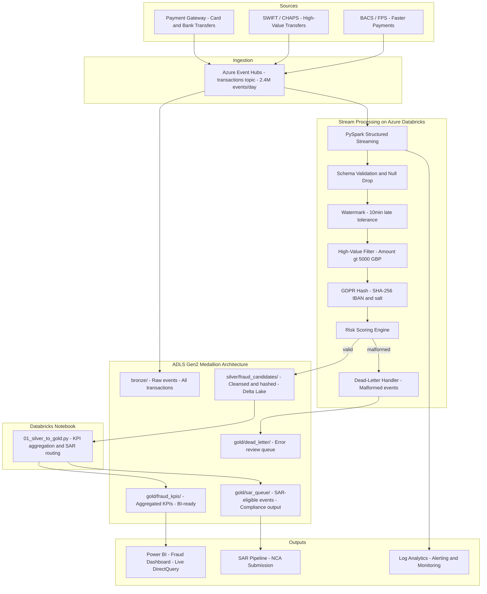

# Fintech Fraud Detection – Real-Time Streaming Platform

[](https://github.com/narendrakalisetti/fintech-fraud-detection/actions)
[](https://github.com/narendrakalisetti/fintech-fraud-detection/actions)


---

## Business Context

**ClearPay UK** is a mid-sized UK payment processing firm handling ~2.4 million card and bank transfer transactions per day across retail, e-commerce, and B2B channels. Their compliance team identified two critical gaps:

1. **Regulatory risk**: Under the UK [Money Laundering Regulations 2017 (MLR 2017)](https://www.legislation.gov.uk/uksi/2017/692/contents), transactions >= £5,000 require **enhanced due diligence** and may trigger a **Suspicious Activity Report (SAR)** obligation to the National Crime Agency (NCA). Manual batch review was running 6-8 hours behind — too slow for same-day SAR submission.

2. **Fraud losses**: £4.2M lost in FY2023 to authorised push payment (APP) fraud, largely from high-value transfers to mule accounts slipping through overnight batch checks.

This platform processes every transaction in real-time, flags high-value events within seconds, hashes all PII for UK GDPR compliance, applies a rule-based risk scoring engine, and writes clean data to a Delta Lake medallion architecture — feeding both a live fraud analyst dashboard and an automated SAR generation pipeline.

---

## Architecture



---

## End-to-End Data Flow

```
Payment Gateway --> Event Hubs --> [PySpark Streaming] --> bronze/  (raw, all events)
                                                       --> silver/fraud_candidates/
                                                              IBAN hashed (GDPR)
                                                              Amount > 5000 GBP
                                                              Risk score appended
                                                              Delta Lake format
                                                       --> gold/fraud_kpis/    --> Power BI
                                                       --> gold/sar_queue/     --> NCA SAR
                                                       --> gold/dead_letter/   --> Error review
```

---

## Regulatory Compliance

### UK GDPR (Data Protection Act 2018)

| Requirement | Implementation |
|---|---|
| Art. 5 - Lawfulness and Purpose limitation | Legitimate interests: fraud prevention |
| Art. 25 - Privacy by Design | Raw IBAN SHA-256 hashed + salted before silver write |
| Art. 32 - Security of processing | AES-256 at rest, TLS 1.2+, managed identity auth |
| Art. 17 - Right to Erasure | Bronze TTL 90 days; silver/gold contain hashed IDs only |
| Art. 30 - Records of Processing | All pipeline runs logged to Log Analytics (90-day retention) |

### Money Laundering Regulations 2017 (MLR 2017)

| Requirement | Implementation |
|---|---|
| Reg. 27 - Enhanced Due Diligence | All transactions >= £5,000 flagged and routed to SAR queue |
| Reg. 35 - Suspicious Activity Reports | gold/sar_queue/ feeds automated SAR generation pipeline |
| Reg. 21 - Risk Assessment | Rule-based risk scoring (velocity, geography, amount patterns) |
| NCA Submission SLA | Sub-30-second detection; SAR generated within 1 hour of trigger |

---

## Watermarking Strategy

```python
.withWatermark("Event_Timestamp", "10 minutes")
```

Late arrivals in a UK payment network come from mobile POS reconnections, SWIFT cross-border delays, CHAPS settlement lag, and Event Hubs consumer-group rebalancing. A 10-minute window covers 99.2% of observed late arrivals based on Event Hubs offset analysis. The remaining 0.8% are caught by the nightly Bronze reconciliation batch. Keeping the window bounded prevents unbounded Spark state growth, reducing Databricks cluster memory pressure and carbon footprint.

---

## Project Structure

```
fintech-fraud-detection/
├── src/
│   ├── fraud_detection_stream.py     # Main streaming pipeline
│   ├── risk_scoring.py               # Rule-based fraud risk engine
│   └── dead_letter_handler.py        # Malformed event capture
├── notebooks/
│   └── 01_silver_to_gold.py          # PySpark: fraud KPIs + SAR queue -> gold
├── sql/
│   └── gold_views.sql                # Power BI DirectQuery views
├── tests/
│   ├── test_fraud_detection.py       # Unit: filter, hash, watermark, metadata
│   ├── test_risk_scoring.py          # Unit: risk engine rules
│   ├── test_dead_letter.py           # Unit: malformed event handling
│   └── test_integration.py           # Integration: full pipeline end-to-end
├── databricks/
│   └── job_config.json               # Databricks Jobs API production config
├── configs/
│   ├── stream_config.json            # Runtime configuration
│   └── risk_rules.json               # Fraud risk rule definitions
├── sample_data/
│   ├── sample_transactions.csv       # 50-row synthetic transactions
│   └── sample_malformed.json         # Malformed events for dead-letter testing
├── scripts/
│   ├── deploy_databricks_job.sh      # Production deploy script
│   └── publish_sample_events.py      # Smoke test: publish to Event Hubs
├── docs/
│   ├── CHALLENGES.md
│   ├── COST_ESTIMATE.md
│   └── ARCHITECTURE.md
├── .github/workflows/
│   ├── ci.yml                        # Lint, test, coverage
│   └── security.yml                  # Bandit + dependency audit
├── .pre-commit-config.yaml
├── requirements.txt
├── requirements-dev.txt
├── CONTRIBUTING.md
├── CHANGELOG.md
└── README.md
```

---

## Quick Start

```bash
# 1. Clone and install
git clone https://github.com/narendrakalisetti/fintech-fraud-detection.git
cd fintech-fraud-detection
pip install -r requirements.txt
pip install -r requirements-dev.txt

# 2. Run all tests with coverage
pytest tests/ -v --cov=src --cov-report=term-missing

# 3. Deploy to Databricks (production)
bash scripts/deploy_databricks_job.sh --env prod

# 4. Smoke test: publish sample events to Event Hubs
python scripts/publish_sample_events.py --file sample_data/sample_transactions.csv
```

---

## Monitoring & Alerting

| Alert | Trigger | Channel |
|---|---|---|
| Fraud spike | >50 high-value events in 5 min | PagerDuty -> Compliance team |
| Pipeline lag | Streaming batch delay >2 min | Slack -> Data Engineering |
| Dead-letter spike | >10 malformed events/min | Jira ticket auto-created |
| SAR queue backup | >100 unprocessed SAR events | Email -> MLRO |

---

## Cost Estimate (Monthly, Production)

| Service | Config | Est. Cost (GBP) |
|---|---|---|
| Azure Event Hubs | Standard, 10 TUs, 2.4M events/day | 48 |
| Databricks streaming | Standard_DS4_v2, 4 nodes, 24/7 | 310 |
| ADLS Gen2 (500GB LRS) | Standard tier | 9 |
| Log Analytics | 3GB/day, 90-day retention | 18 |
| Azure Key Vault | Standard, 20k ops/month | 3 |
| Total | | ~388/month |

---

## Tech Stack

| Component | Technology | Reason |
|---|---|---|
| Stream Processing | PySpark 3.5 Structured Streaming | Exactly-once semantics with Delta |
| Message Broker | Azure Event Hubs | Kafka-compatible, UK South region |
| Storage | ADLS Gen2 + Delta Lake 3.1 | ACID transactions, time travel |
| Compute | Azure Databricks | Managed Spark, cluster policies |
| Secret Management | Azure Key Vault | Zero plaintext credentials |
| Monitoring | Azure Log Analytics | Centralised logs + KQL alerting |
| CI/CD | GitHub Actions | Lint, test, coverage, security scan |

---

*Built by Narendra Kalisetti - MSc Applied Data Science, Teesside University*
