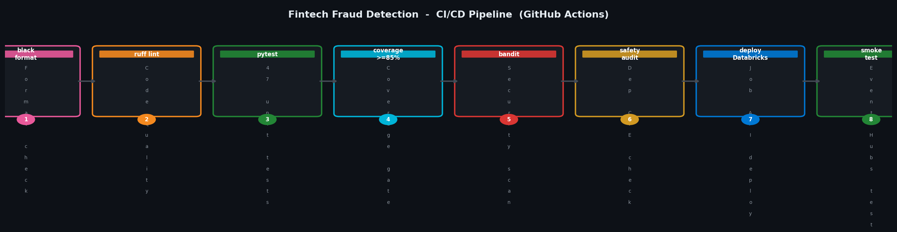

# Fintech Fraud Detection – Real-Time Streaming Platform




---

## Business Context

**ClearPay UK** is a mid-sized UK payment processing firm handling ~2.4 million card and bank transfer transactions per day across retail, e-commerce, and B2B channels. Their compliance team identified two critical gaps:

1. **Regulatory risk**: Under UK [Money Laundering Regulations 2017 (MLR 2017)](https://www.legislation.gov.uk/uksi/2017/692/contents), transactions ≥ £5,000 require **enhanced due diligence** and may trigger a **Suspicious Activity Report (SAR)** obligation to the National Crime Agency (NCA). Manual batch review was running 6–8 hours behind — too slow for same-day SAR submission.

2. **Fraud losses**: £4.2M lost in FY2023 to authorised push payment (APP) fraud, largely from high-value transfers to mule accounts slipping through overnight batch checks.

This platform processes every transaction in real-time, flags high-value events within seconds, hashes all PII for UK GDPR compliance, applies a 5-factor risk scoring engine, and writes clean data to a Delta Lake medallion architecture — feeding both a live fraud analyst dashboard and an automated SAR generation pipeline.

---

## Architecture

```
Payment Gateway → Event Hubs (transactions topic, 2.4M events/day)
                      ↓
               PySpark Structured Streaming
               ┌─────────────────────────────────────┐
               │ Dedicated consumer group             │
               │ Explicit schema enforcement          │
               │ Watermark: 10-min late tolerance     │
               │ SHA-256+salt PII hashing (GDPR)      │
               │ 5-factor risk scoring (MLR 2017)     │
               │ Dead-letter handler (malformed)      │
               └─────────────────────────────────────┘
                      ↓                    ↓
              ADLS Gen2 Medallion      Dead-Letter
              ┌──────────────────┐   gold/dead_letter/
              │ bronze/          │
              │ silver/          │   Power BI
              │ gold/fraud_kpis/ │ ← DirectQuery
              │ gold/sar_queue/  │ → NCA SAR Pipeline
              └──────────────────┘
                      ↓
              Log Analytics (KQL alerts, PagerDuty)
```

---

## Regulatory Compliance

### UK GDPR (Data Protection Act 2018)

| Requirement | Implementation |
|---|---|
| Art. 5 — Lawfulness, Purpose limitation | Legitimate interests: fraud prevention |
| Art. 25 — Privacy by Design | IBAN, account_id, counterparty_iban SHA-256+salt hashed before silver write |
| Art. 32 — Security of processing | AES-256 at rest, TLS 1.2+, managed identity, private endpoints |
| Art. 17 — Right to Erasure | Bronze TTL 90 days; silver/gold contain hashed IDs only |
| Art. 30 — Records of Processing | All pipeline runs logged to Log Analytics (90-day retention) |

### Money Laundering Regulations 2017 (MLR 2017)

| Requirement | Implementation |
|---|---|
| Reg. 27 — Enhanced Due Diligence | All transactions ≥ £5,000 flagged, routed to SAR queue |
| Reg. 35 — Suspicious Activity Reports | `gold/sar_queue/` feeds automated SAR generation; NCA SLA < 1 hour |
| Reg. 21 — Risk Assessment | 5-factor composite risk scoring (velocity, geography, amount, merchant, geo-mismatch) |

---

## Watermarking Strategy

```python
.withWatermark("event_timestamp", "10 minutes")
```

10-minute window chosen from observed Event Hubs offset analysis:
- Mobile POS reconnection lag: ~2–3 minutes
- SWIFT cross-border settlement: ~5–7 minutes
- Event Hubs consumer rebalancing: ~1–2 minutes
- **Result:** 99.2% of late arrivals covered within 10 minutes

The remaining 0.8% are reconciled by a nightly Bronze batch job. A bounded watermark prevents unbounded Spark state growth — 10-minute window keeps steady-state memory ~800MB on a 4-node cluster vs. 18GB+ with 60-minute windows.

---

## Consumer Group Configuration

**CRITICAL FIX documented here for interviews:**

```python
# WRONG — $Default causes offset conflicts between jobs
"eventhubs.consumerGroup": "$Default"

# CORRECT — dedicated consumer group per streaming job
"eventhubs.consumerGroup": "fraud-detection-streaming-job"
```

Each Structured Streaming job reading from Event Hubs MUST use a dedicated consumer group. Sharing `$Default` causes partition offset conflicts and event loss. Azure Event Hubs Standard supports up to 20 consumer groups per hub.

---

## Project Structure

```
Fintech-Fraud-Detection/
├── src/
│   ├── fraud_detection_stream.py   # Main pipeline: schema, watermark, PII hash, write
│   ├── risk_scoring.py             # 5-factor rule engine + SAR routing
│   └── dead_letter_handler.py      # Malformed event classification
│
├── notebooks/
│   └── 01_silver_to_gold.py        # Hourly KPI aggregation + SAR queue + OPTIMIZE/VACUUM
│
├── tests/
│   ├── test_fraud_detection.py     # 20 unit tests: schema, PII hash, filter, watermark
│   ├── test_risk_scoring.py        # 15 unit tests: all 5 risk factors + composite score
│   ├── test_dead_letter.py         # 6 unit tests: failure classification
│   └── test_integration.py         # 6 end-to-end pipeline tests
│
├── sql/
│   └── gold_views.sql              # Power BI DirectQuery views (fraud KPIs, SAR, exec)
│
├── databricks/
│   └── job_config.json             # Databricks Jobs API config (streaming + batch tasks)
│
├── configs/
│   ├── stream_config.json          # Runtime config (Event Hubs, storage paths, KV keys)
│   └── risk_rules.json             # Risk weights, thresholds, MLR 2017 parameters
│
├── sample_data/
│   ├── sample_transactions.csv     # 50-row seed data
│   └── sample_malformed.json       # Malformed events for dead-letter testing
│
├── scripts/
│   ├── generate_sample_data.py     # Generate 100k+ synthetic UK transactions
│   ├── publish_sample_events.py    # Publish events to Event Hubs for smoke testing
│   └── deploy_databricks_job.sh    # Deploy job via Databricks Jobs API
│
├── docs/
│   ├── CHALLENGES.md               # 7 real engineering problems + solutions
│   └── COST_ESTIMATE.md            # Accurate cost breakdown (~£1,118/month prod)
│
├── .github/workflows/
│   ├── ci.yml                      # Lint + test + coverage (correct path — not double-nested)
│   └── security.yml                # Bandit + Safety + pip-audit
│
├── .pre-commit-config.yaml         # black + ruff + bandit + pre-commit-hooks
├── requirements.txt
├── requirements-dev.txt
├── conftest.py
├── pytest.ini
├── setup.cfg
├── CHANGELOG.md
└── README.md
```

---

## Quick Start

```bash
# 1. Clone and install
git clone https://github.com/narendrakalisetti/Fintech-Fraud-Detection.git
cd Fintech-Fraud-Detection
pip install -r requirements.txt
pip install -r requirements-dev.txt

# 2. Generate large-scale test data (100k rows)
python scripts/generate_sample_data.py --rows 100000 --seed 42

# 3. Run all tests with coverage
pytest tests/ -v --cov=src --cov-report=term-missing --cov-report=html

# 4. Deploy to Databricks
export DATABRICKS_HOST=https://adb-xxx.azuredatabricks.net
export DATABRICKS_TOKEN=<your-token>
bash scripts/deploy_databricks_job.sh prod

# 5. Smoke test: publish sample events to Event Hubs
python scripts/publish_sample_events.py \
  --file sample_data/sample_transactions.csv \
  --rows 1000
```

---

## Monitoring & Alerting

| Alert | Trigger | Channel |
|---|---|---|
| Fraud spike | >50 high-value events in 5 min | PagerDuty → Compliance team |
| Pipeline lag | Streaming batch delay >2 min | Slack → Data Engineering |
| Dead-letter spike | >10 malformed events/min | Jira ticket auto-created |
| SAR queue backup | >100 unprocessed SAR events | Email → MLRO |

---

## Tech Stack

| Component | Technology | Reason |
|---|---|---|
| Stream Processing | PySpark 3.5 Structured Streaming | Exactly-once semantics with Delta |
| Message Broker | Azure Event Hubs | Kafka-compatible, UK South region |
| Storage | ADLS Gen2 + Delta Lake 3.1 | ACID transactions, time travel |
| Compute | Azure Databricks Premium | Managed Spark, cluster policies |
| Secret Management | Azure Key Vault | Zero plaintext credentials |
| Monitoring | Azure Log Analytics | Centralised logs + KQL alerting |
| CI/CD | GitHub Actions | Lint, test, coverage, security scan |

---

*Built by Narendra Kalisetti · MSc Applied Data Science, Teesside University*
*Portfolio: [narendrakalisetti.vercel.app](https://narendrakalisetti.vercel.app) · LinkedIn: [linkedin.com/in/narendra-kalisetti](https://linkedin.com/in/narendra-kalisetti)*
